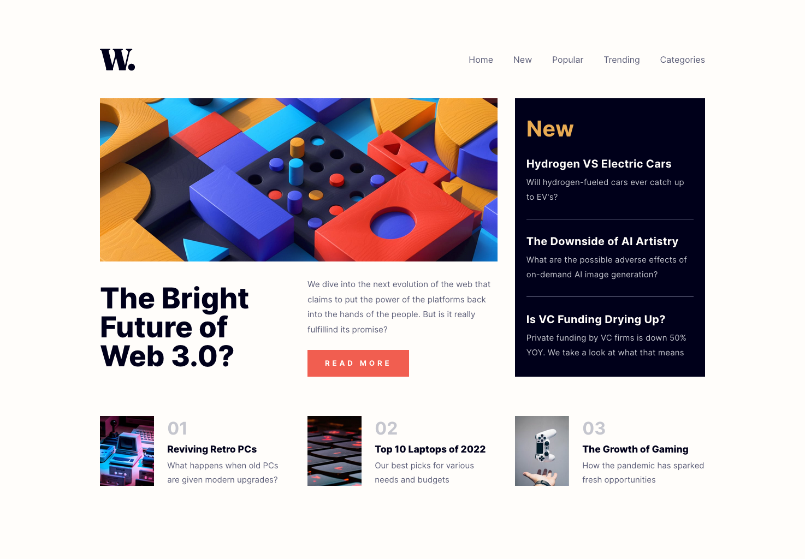

# Frontend Mentor - News homepage solution

This is a solution to the [News homepage challenge on Frontend Mentor](https://www.frontendmentor.io/challenges/news-homepage-H6SWTa1MFl). Frontend Mentor challenges help you improve your coding skills by building realistic projects.

## Table of contents

- [Overview](#overview)
  - [The challenge](#the-challenge)
  - [Screenshot](#screenshot)
  - [Links](#links)
- [My process](#my-process)
  - [Built with](#built-with)
  - [What I learned](#what-i-learned)
  - [Useful resources](#useful-resources)
- [Author](#author)
- [Acknowledgments](#acknowledgments)

## Overview

### The challenge

Users should be able to:

- View the optimal layout for the interface depending on their device's screen size
- See hover and focus states for all interactive elements on the page
- **Bonus**: Toggle the mobile menu (requires some JavaScript)

### Screenshot

### Links

- Solution URL: [Add solution URL here](https://your-solution-url.com)
- Live Site URL: [Add live site URL here](https://your-live-site-url.com)

## My process

### Built with

- ReactJS
- Styled-Components
- Flexbox
- CSS Grid
- Mobile-first workflow
- React-Router-Dom
- [React](https://reactjs.org/) - JS library
- [Styled Components](https://styled-components.com/) - For styles
- [React-Router-Dom](https://reactrouter.com/en/6.4.3) - React framework

### What I learned

It is always a pleasure to review all the topics studied during my learning path. In this project I wanted to brush up on my skills to optimally use grid layout, use react to create a UI as similar as possible to requests and react-router-dom, even if just implemented in a simple way without any pages to show.

### Continued development

Next step is to get another challenge and try out, or improve, new skills and topics. For example I want to review my RTK and RTK queries knowledge.

## Author

- Website - [Antonio](https://github.com/antonADev)
- Frontend Mentor - [@antonADev](https://www.frontendmentor.io/profile/antonADev)
- Twitter - [@AntonioAurello](https://www.twitter.com/AntonioAurello)
